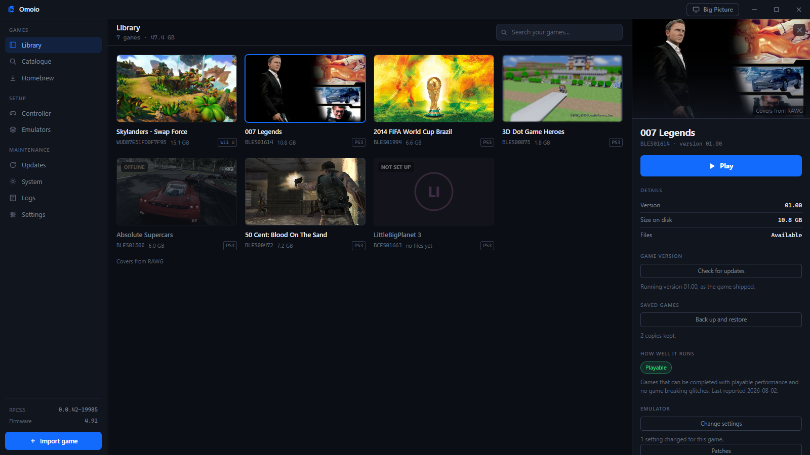
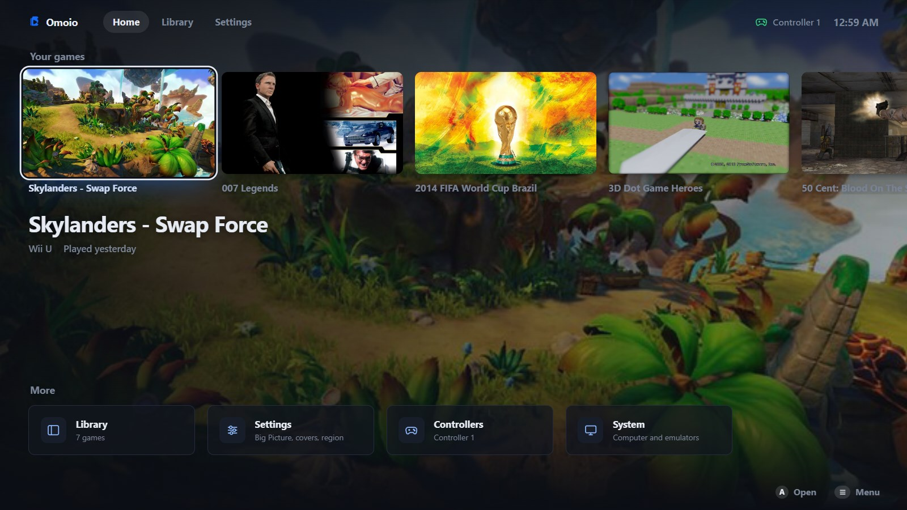
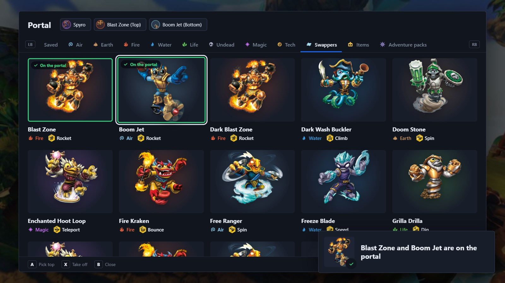
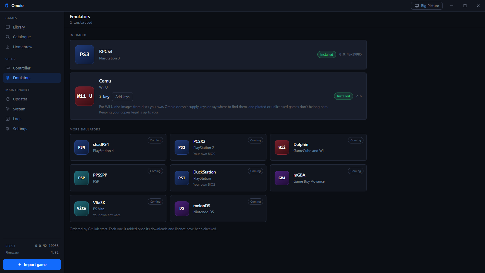

<p align="center">
  
</p>
<h1 align="center">Omoio</h1>
<p align="center">Your PS3 and Wii U games in one library. Press Play and Omoio sets up the emulator for you.</p>


<sub>Covers in these pictures come from [RAWG](https://rawg.io).</sub>

Omoio is a game library for Windows. You import the dumps of games you own
and press Play. Omoio installs the emulator and sets up your controller, then
starts the game in its own window. It's made for big collections spread across
systems, the kind that sits on a few drives in a home lab.

Omoio is in very early development. PS3 games run through RPCS3 and Wii U games
through Cemu, and more systems are planned. Things will break, and feedback is
really appreciated, so open an issue.

## What you get

- One library for every system. Import a folder, a zip or 7z file, or scan a
  whole drive at once.
- Games run inside Omoio's window, fullscreen with F11, and you never see the
  emulator.
- RPCS3 and Cemu installed for you and kept up to date.
- One controller layout for every emulator, set by pressing the buttons, for up
  to four players.
- For PS3 games, official updates, community patches, save backups and RPCS3's
  settings for each game. Homebrew installs from a .pkg you already have.
- For Wii U games, Cemu's settings for each game, and disc images read with your
  own keys.
- A catalogue of PS3 and Wii U games that tells you how well each one runs.
- Real covers from RAWG if you add a free key. Without one, Omoio draws its own
  tiles.

## Big Picture



Big Picture fills the screen and is made for a TV and a controller, with each
game's settings, patches and saves inside it. Press View and Menu together
during a game to come back to Big Picture while the game keeps running. The same
two buttons take you back into the game.

## The Skylanders portal



Skylanders games need figures on a portal. In a Skylanders game on Wii U, press
the Guide button, or the button you picked for it, and Omoio's portal menu opens
over the game. Choose a character with the controller and it goes on the
portal. The first time, Cemu's own figure maker makes the figure, and Omoio saves
it so the figure keeps what it has earned. Swappers can be mixed: pick a top,
then a bottom, and each one shows how it moves.

Omoio can also show every figure's own picture, read from your copy of SWAP
Force: a .wua file that Cemu packed, or an unpacked game folder. A small
separate program, [omoio-portraits](https://github.com/Bertrram/omoio-portraits),
does the reading. Omoio downloads it only when you ask and checks it before it
runs. The pictures stay on your computer.

## Install

Download `Omoio_x.y.z_x64-setup.exe` from [Releases](../../releases) and run it.
It doesn't need admin rights. On first start it asks which emulators you want.
PS3 games also need Sony's free firmware: Omoio opens Sony's download page and
installs the file you pick.

The installer isn't code signed yet, so Windows SmartScreen may warn you. Click
More info, then Run anyway.

## Q&A

<details>
<summary>Does Omoio come with games, or say where to find them?</summary>
<br>

No. Omoio plays dumps of games you own. It won't download games, link to them
or help you find them.

</details>

<details>
<summary>Which systems does it run?</summary>
<br>

PS3 through RPCS3 and Wii U through Cemu. The Emulators screen lists what comes
next: PS4, PS2, GameCube and Wii, PSP, PS1, Game Boy Advance, PS Vita and DS.
Each one is added once its download and its licence have been checked.



</details>

<details>
<summary>Do I need to install RPCS3 or Cemu first?</summary>
<br>

No. Omoio downloads their official builds and keeps them up to date. It runs them
as separate programs, and you never have to open either one.

</details>

<details>
<summary>Why does Windows warn me about the installer?</summary>
<br>

SmartScreen warns about programs that aren't code signed, and a signing
certificate costs money every year, so Omoio doesn't have one yet. Click More
info, then Run anyway.

</details>

<details>
<summary>Where does the PS3 firmware come from?</summary>
<br>

From Sony. Omoio opens Sony's official firmware page, you download the file, and
Omoio installs the one you pick. It never fetches firmware by itself.

</details>

<details>
<summary>Why won't my Wii U disc image import?</summary>
<br>

Wii U disc images (.wud and .wux) are encrypted, and Cemu needs your disc's key
to read one. Add your own keys file on the Emulators screen. Omoio hands the keys
to Cemu and never supplies any. Unpacked game folders need no keys. Downloads in
NUS form aren't supported.

</details>

<details>
<summary>Which controllers work?</summary>
<br>

Xbox controllers, and other pads that speak XInput, work in both emulators.
Other pads work in RPCS3 through SDL, and Cemu doesn't take them yet. You set one
layout on the Controller screen and Omoio uses it everywhere, for up to four
players.

</details>

<details>
<summary>Where are my saves?</summary>
<br>

PS3 saves are in Omoio's own copy of RPCS3. Omoio backs them up before every
game update, and the game's panel can back them up or put an older copy back.
Wii U saves are in Omoio's copy of Cemu, without backups so far.

</details>

<details>
<summary>Does Omoio change the emulators' settings?</summary>
<br>

Only where it has a reason it can point to. It writes your controller layout. For
PS3 games it also sets a resolution that fits your screen, and switches on a
short list of fixes for named games, each with its reason shown. Everything else
stays at the emulator's defaults, and you can change any setting for each game.

</details>

<details>
<summary>Where do the covers come from?</summary>
<br>

By default Omoio draws its own tiles. Turn covers on in Settings and add a free
RAWG key, and Omoio shows RAWG's pictures with a credit wherever they appear.

</details>

<details>
<summary>Does it run on Mac or Linux?</summary>
<br>

No, only on Windows.

</details>

<details>
<summary>Something broke. What should I send?</summary>
<br>

Open an issue that says which game it was and what happened. The Logs screen
keeps a log of every play session, and the one from when it went wrong helps a
lot.

</details>

## The small print

Omoio doesn't come with games and won't help you find any, so bring your own
dumps of games you own. It doesn't crack anything: Wii U disc images need your
own keys file, and Cemu does the decrypting. PS3 firmware comes from Sony's page,
downloaded by you. Covers come only from RAWG, and the Skylanders pictures only
from your own copy of the game. RPCS3 and Cemu are separate projects, run as
their official builds, and all credit for the emulation goes to them.

## Build

Needs Rust, Node 20 or newer, and the Tauri prerequisites for Windows.

```
npm install
npm run tauri dev      # run locally
npm run tauri build    # build the installer
```

## Licence

Not decided yet.
