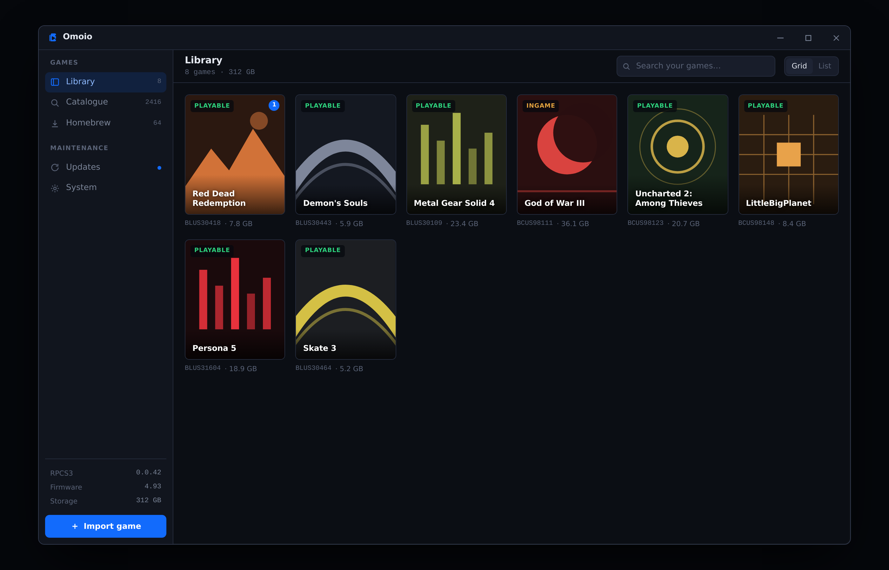

# Omoio

Omoio is a desktop app for PS3 emulation. You point it at a game you already own,
and it handles the setup, updates and configuration that RPCS3 leaves to you.

In development. Nothing here is usable yet.



## What it does

Omoio installs and manages RPCS3 for you, detects your hardware, imports a game
folder or archive in one step, finds official updates, applies community patches,
and launches the game. No manual folder work, no title ID lookups, no emulator
menus.

## What it does not do

Omoio does not distribute games. It has no store, no download button for
commercial titles, and no links to anywhere you might find them. You supply your
own copy of a game you own, and Omoio takes it from there.

It also does not touch copy protection. Omoio reads dumps that are already
decrypted, and it never handles keys of any kind.

PS3 firmware comes from Sony. Omoio can open their download page for you, but you
download the file and pick it yourself.

RPCS3 is a separate program, downloaded from its official releases and run as its
own process. Omoio does not bundle or modify it. All credit for the emulation
itself belongs to the RPCS3 team.

## Install

Download the latest `Omoio_x.y.z_x64-setup.exe` from Releases and run it. It
installs for the current user and does not need administrator rights.

Windows may show a SmartScreen warning, because the installer is not code signed
yet. Certificates cost money per year, and that is not worth it before the project
has users. Choose More info, then Run anyway, if you are comfortable with that.

## Build

Requires Rust, Node 20 or newer, and the Tauri prerequisites for Windows.

```
npm install
npm run tauri dev      # run locally
npm run tauri build    # produce the installer
```

## Licence

Not decided yet.
