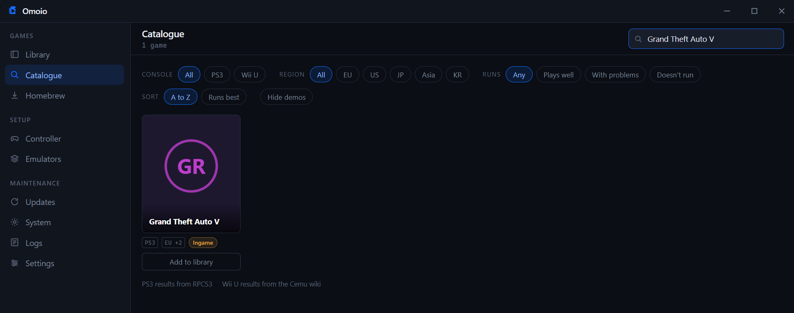

# Omoio

Omoio is a Windows app for playing the PS3 and Wii U games you already own. You
point it at a game, and it installs and updates the emulator, sets up your
controller and the picture, and starts the game, so you never have to open an
emulator yourself.

In development, and usable.



The tiles here are Omoio's own. Real cover art for your library and the catalogue
is one switch away in Settings, with a free key from RAWG.

## Install

Download the latest `Omoio_x.y.z_x64-setup.exe` from Releases and run it. It
installs for the current user and does not need administrator rights. The first
time it opens, it asks which emulators to install: RPCS3 for PS3 games, Cemu for
Wii U games, or both. It keeps them up to date from then on.

Windows may show a SmartScreen warning, because the installer is not code signed
yet. Certificates cost money per year, and that is not worth it before the project
has users. Choose More info, then Run anyway, if you are comfortable with that.

## What Omoio will not do

Omoio does not distribute games. It has no store, no download button for
commercial titles, and no links to anywhere you might find them. You supply your
own copy of a game you own, and Omoio takes it from there.

Omoio never decrypts anything and never supplies keys. It reads PS3 dumps that are
already decrypted. For Wii U disc images (.wud and .wux), you can give Cemu your
own keys file from the Emulators screen, and Cemu does the decrypting. Omoio never
says where to find a key, and it refuses Wii U downloads in NUS form. Pirated or
unlicensed games do not belong in Omoio, and whether a copy is legal is your
responsibility.

PS3 firmware comes from Sony. Omoio can open their download page for you, but you
download the file and pick it yourself.

RPCS3 and Cemu are separate programs, downloaded from their official releases and
run as their own processes. Omoio does not bundle or modify them. All credit for
the emulation itself belongs to the RPCS3 and Cemu teams.

Cover art only ever comes from RAWG's API. Omoio never takes images from anywhere
else.

## Build

Requires Rust, Node 20 or newer, and the Tauri prerequisites for Windows.

```
npm install
npm run tauri dev      # run locally
npm run tauri build    # produce the installer
```

## Licence

Not decided yet.
